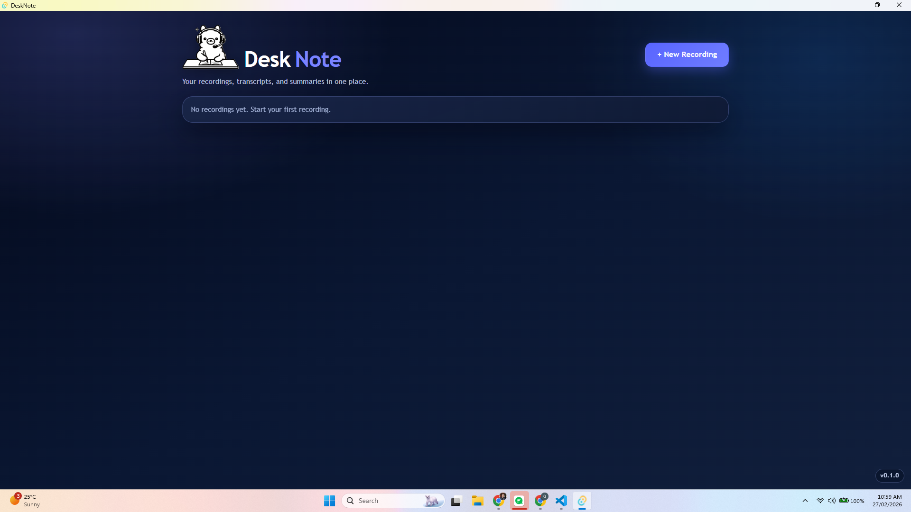
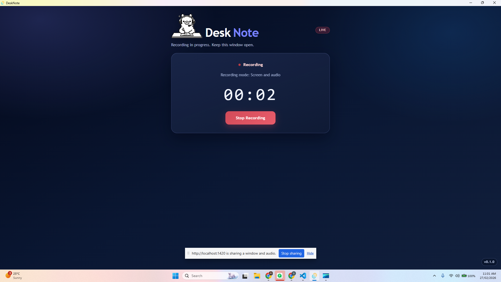
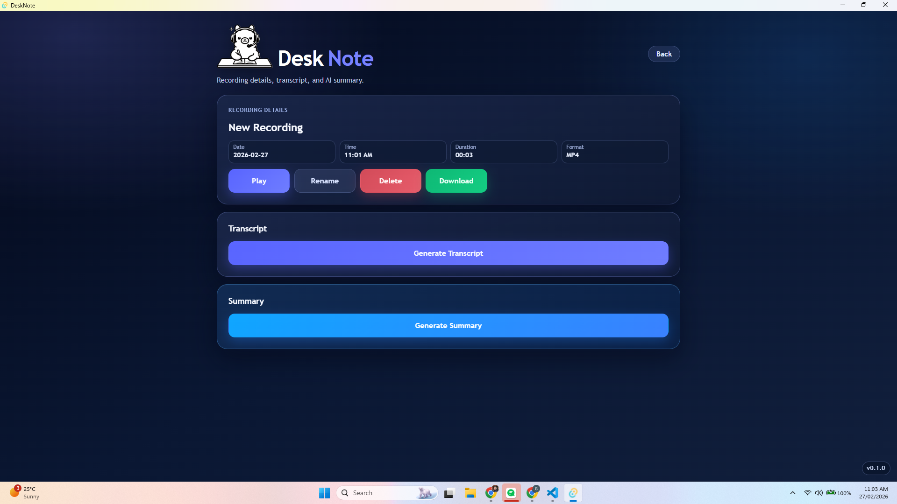
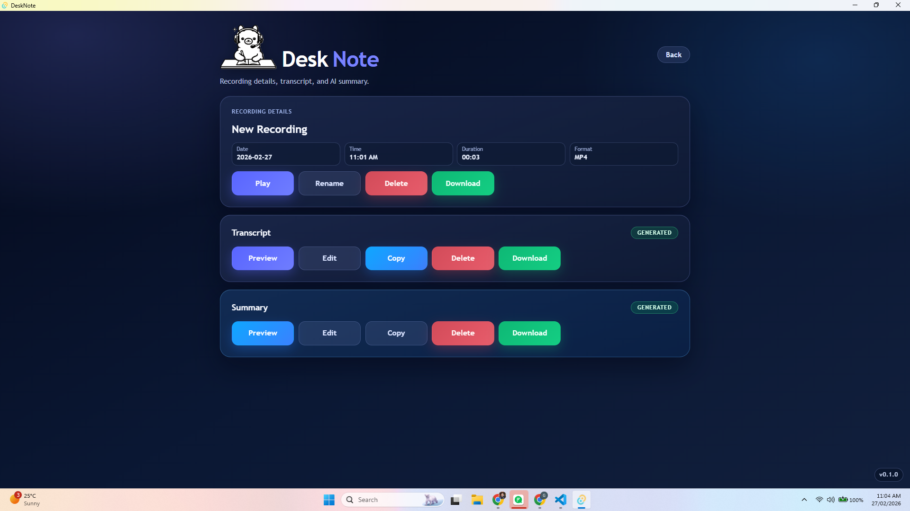
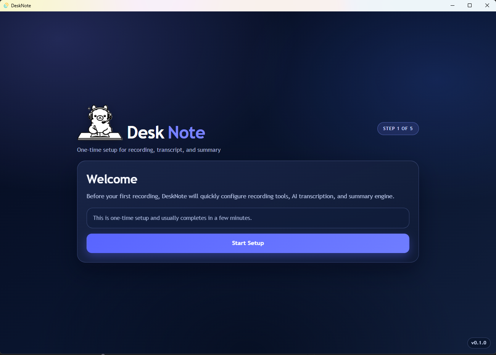
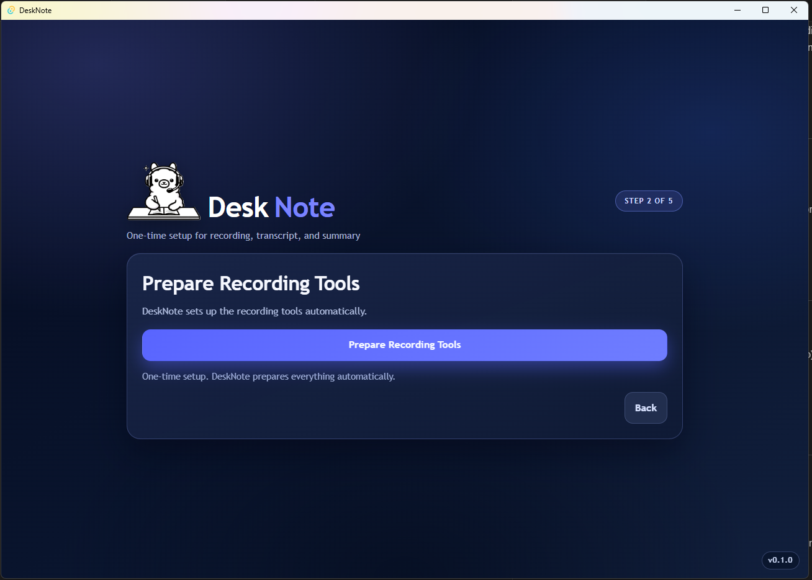
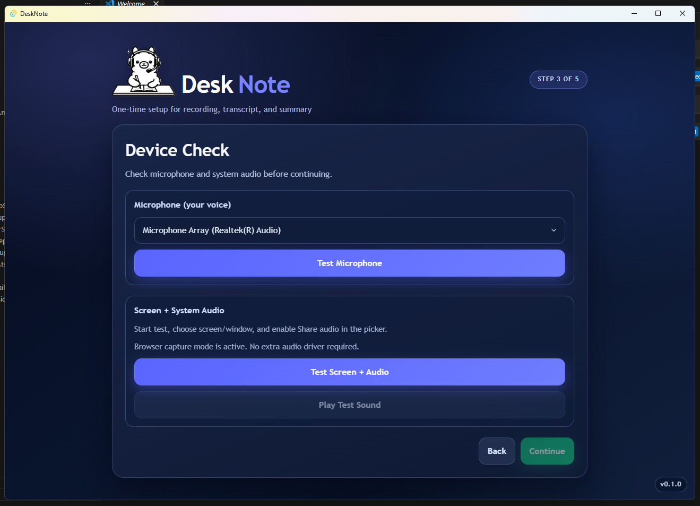
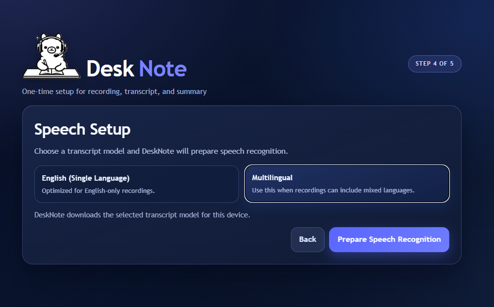
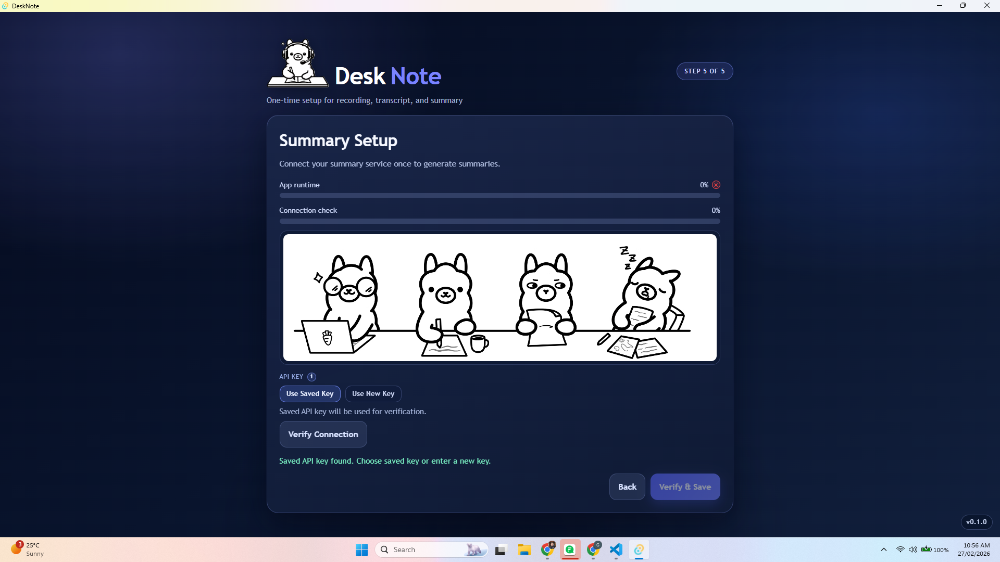

# DeskNote
 

 
<h2>DeskNote is a <b>Windows desktop app</b> for screen recording with AI transcription and summary generation.</h2>
 
## What The App Does ?
 
✅ Records your screen with system audio and microphone input
 
✅ Organizes recordings in a dashboard with rename/delete/open actions
 
✅ Generates a transcript for each completed recording
 
✅ Generates a concise AI summary from the transcript
 
✅ Lets you preview, edit, copy, and download video/transcript/summary outputs
 
 

## How It Works 🤔 ?

1. On first launch, DeskNote runs a one-time setup.
2. You start a new recording from the dashboard.
3. The app captures screen and audio, then stores the recording locally.
4. Transcript generation processes the recording audio.
5. Summary generation uses your configured cloud model.

 
 

## App Pages 📄

- Setup Wizard (5 steps)
- Dashboard
  
 
- Recording Session (live timer + stop)
 

- Recording Detail (video, transcript, summary actions)
 

 

 

## Setup Wizard Steps 🧙‍♂️

1. Welcome </n>
 

2. Prepare Recording Tools
 

3. Device Check (microphone + screen/system audio)
 
 
4. Speech Setup (transcript model)
 
 
5. Summary Setup (API key + model verification)
 
 

## Technology Used 💻 ⚙️ 

- Tauri desktop runtime (Rust backend)
- React + TypeScript frontend
- FFmpeg-based media tooling
- Whisper-based local transcription
- Python summarization worker with Ollama Cloud model access
 
 

## Privacy And Data 🔐

- Recording files and generated text files are stored on your device.
- Summary generation sends transcript content to your configured cloud model endpoint.
- API credentials are stored using OS secure credential storage.
 
 

## Requirements 🖐️

- Windows 10/11
- Screen capture and microphone permissions
- Internet connection for setup downloads and cloud summary generation
 
 

## Download And Use ➡️💻 🥂

1. Open the project Releases page.
2. Download the latest `.exe`.
3. Run the installer/executable.
4. Complete setup once, then start recording.

